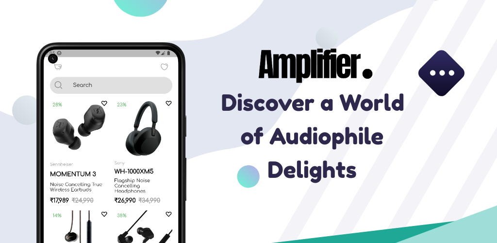

# Amplifier - Audiophile Ecommerce App

Amplifier is a cutting-edge audiophile ecommerce app built with Flutter. It offers a seamless and immersive shopping experience for audio enthusiasts, providing a wide range of high-quality headphones and other audio electronics. This README provides an overview of the app's features and functionalities.

## Features

### Intuitive User Interface
Amplifier boasts a sleek and user-friendly interface designed to enhance the overall shopping experience. With its intuitive navigation, customers can effortlessly browse through the app, explore product categories, and discover the latest audio gear.

### Product Catalog
Discover a vast collection of premium headphones and audio electronics. Amplifier offers a diverse range of products to cater to the needs of different audiophiles, ensuring there's something for everyone. Each product listing includes detailed information, high-resolution images, and customer reviews.

### Advanced Search
Finding the perfect audio equipment is made easy with Amplifier's advanced search functionality. Users can search for specific products based on various criteria, such as brand, price range, connectivity options, and more. This feature helps customers quickly locate the items they desire.

### Wishlist and Favorites
Users can create personalized wishlists and mark favorite products to easily track and manage their preferences. The wishlist feature allows customers to save items they are interested in for future purchase, while the favorites section lets them keep a curated list of their most-loved audio gear.

### Secure Checkout
Amplifier prioritizes the security of customer transactions. The app integrates with trusted payment gateways, ensuring secure and hassle-free checkout processes. Users can confidently make purchases knowing that their payment information is protected.

### Order Tracking
Once a purchase is made, customers can conveniently track their orders within the app. Amplifier provides real-time updates on the shipping status, estimated delivery dates, and other relevant information, ensuring transparency throughout the entire fulfillment process.

## Performance and Animation

Amplifier prioritizes both performance and animation to create a smooth and delightful user experience.

### High Performance
Built with Flutter, Amplifier leverages the framework's inherent performance benefits. Flutter's efficient rendering engine allows the app to deliver fast and responsive interactions, ensuring a seamless shopping experience even on lower-end devices.

### Smooth Page Transitions
Amplifier implements smooth page transitions to enhance the app's overall flow and user engagement. Whether users are navigating between product listings, the shopping cart, or the checkout process, they will experience visually appealing and fluid transitions that provide a polished feel.

### Hero Animation
To create a visually stunning and engaging experience, Amplifier incorporates hero animations. These animations allow for seamless transitions between product thumbnails and the product detail page, creating an immersive and captivating environment for users.

The combination of high performance, smooth page transitions, and hero animations in Amplifier ensures a visually appealing and responsive app that enhances the overall user experience.

## Download

- **[Google Play Store](https://play.google.com/store/apps/details?id=com.amplifier.ecommerce)**: Download the app from the Google Play Store.

- **[GitHub Releases](https://github.com/leywino/amplifier/releases)**: Get the latest release from the GitHub repository.